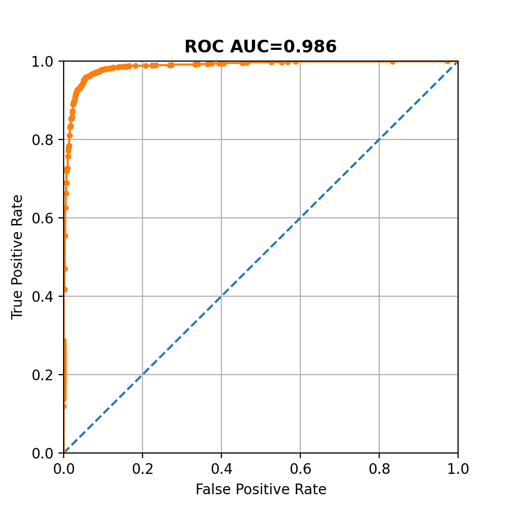

# CryoFilter

**Author**: Simon Thomas

**Date**: October 2020

**Contact**: simon.thomas@uq.edu.au


# Training

The default parameters for training are reasonable and it may not be that necessary to fine-tune the network.

```bash
usage: train.py [-h] [--pos POS [POS ...]] [--neg NEG [NEG ...]]
                [--weight_dir WEIGHT_DIR] [--batch_size BATCH_SIZE]
                [--split SPLIT] [--epochs EPOCHS] [--img_dim IMG_DIM]
                [--learning_rate LEARNING_RATE] [--augmentation AUGMENTATION]
                [--history_dir HISTORY_DIR]

Train network

optional arguments:
  -h, --help            show this help message and exit
  --pos POS [POS ...]   mrcs files belonging to the positive class
  --neg NEG [NEG ...]   mrcs files belonging to the negative class
  --weight_dir WEIGHT_DIR
                        Directory to saves weights in. Weights ~= 500kb
  --batch_size BATCH_SIZE
                        Number of images to train at once - between 12 and 128
                        is fine
  --split SPLIT         Train : Validation split - (1-split) will be shared
                        for between validation, test
  --epochs EPOCHS       Number of times to train on the whole dataset
  --img_dim IMG_DIM     The size to resize to e.g. 256x256 -> 28x28. Larger is
                        more computation
  --learning_rate LEARNING_RATE
                        Learning rate of network - default is pretty good
  --augmentation AUGMENTATION
                        Using data augmentation- default is True
  --history_dir HISTORY_DIR
                        Diretory to save history.csv
  --model MODEL
                        

```

The following is an example of how to use the training script:
```
python train.py --pos ./data/pos.mrcs ./data/pos_top.mrcs --neg ./data/neg.mrcs --weight_dir ./weights/ --batch_size 32 --split 0.7 --epochs 10 --img_dim 28 --learning_rate 0.001 --history_dir "."
```

To select the best model which minimises **over-fitting**, select the weights where the validation
accuracy is at its highest before it stops improving. This model can be used for later prediction.
During training, the only metrics monitored are `train_loss`, `train_acc`, `val_loss` and `val_acc`.
At the end of training they will be saved in the `history.csv` written to the `--history_dir` directory.

The model can be evaluated more thoroughly using the `metrics.py` script. You can point it to a mrc
and provide and output directory and weights. It will produce an AUC statistic and save the ROC and Confusion
Matrix plots in the output directory.

```
usage: metrics.py [-h] [--pos POS [POS ...]] [--neg NEG [NEG ...]]
                  [--weights WEIGHTS] [--out_dir OUT_DIR] [--split SPLIT]
                  [--batch_size BATCH_SIZE] [--img_dim IMG_DIM] [--tta TTA]
                  [--model MODEL]

Evaluate network

optional arguments:
  -h, --help            show this help message and exit
  --pos POS [POS ...]   mrcs files belonging to the positive class
  --neg NEG [NEG ...]   mrcs files belonging to the negative class
  --weights WEIGHTS     Path to the model weights
  --out_dir OUT_DIR     Where to save the ROC plot.
  --split SPLIT         The split for training : validation. Use 1. to
                        evaluate the whole dataset
  --batch_size BATCH_SIZE
                        Number of images to train at once - between 12 and 128
                        is fine
  --img_dim IMG_DIM     The size to resize to e.g. 256x256 -> 28x28. Larger is
                        more computation
  --tta TTA             Whether to use Test-Time Augmentation when evaluating
                        the model
  --model MODEL         The model type to use. e.g. "straight" or "roberts"

```

Usage is:

```
python metrics.py --pos ./data/pos.mrcs ./data/pos_top.mrcs --neg ./data/neg.mrcs --out_dir ./output/ --weights ./weights/model_weights.h5
```

The output will be:

```
--------------------------
   Performance Summary    
--------------------------
Auc : 0.975
CM :
[[ 846.  136.]
 [  66. 1984.]]
Acc : 0.933
Specificity : 0.862
Sensitivity : 0.968

Saving figure: ./output/roc.png

```



# Prediction

Prediction in the wild is done using `score.py` with an output of a score between
 0-1 for each image, in the order found in the stack. The scores are saved as a
 csv file, saved as `--out_file [*.csv]`. You can additionally use the --tta argument
 which will included [test-time augmentation](https://www.nature.com/articles/s41598-020-61808-3).
 This performances left/right flips and 90°, 180°, 270° rotations for each *individual* image,
 and then takes the mean prediction. This can boost performance but predicts each images 8 times, and thus requires
 more time. Example usage:
 
```
python score.py --mrc ./data/neg.mrcs --out_file ./output/neg_scores.csv --weights ./weights/weights_epoch_99_val_acc_0.981.h5
```

`neg_scores.csv` will look like:

```
0, 0.032
1, 0.003
2, 0.000
3, 0.002
4, 0.047
...
```

There is also the option to extract features from the model which can be saved as
a numpy array. This just needs to be used with the `--features True` argument, as
well as changing the `--out_file` to something like `features.npy`. The output shape will be `(N, 64)`.


 
 
 
 

